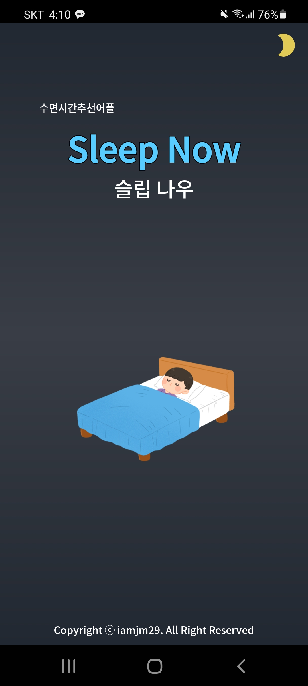
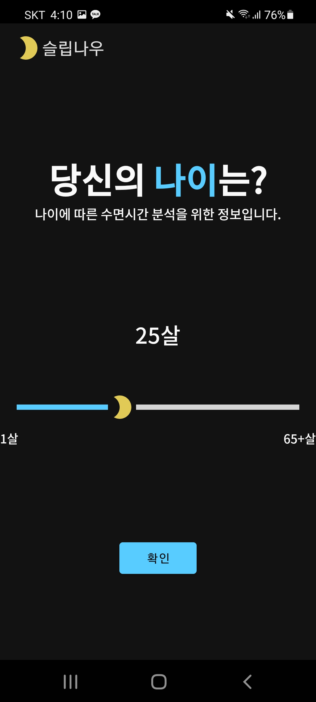
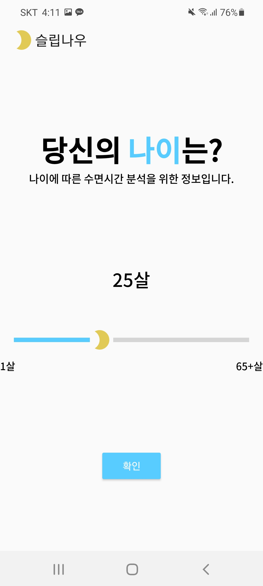
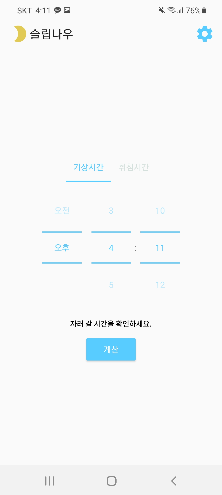
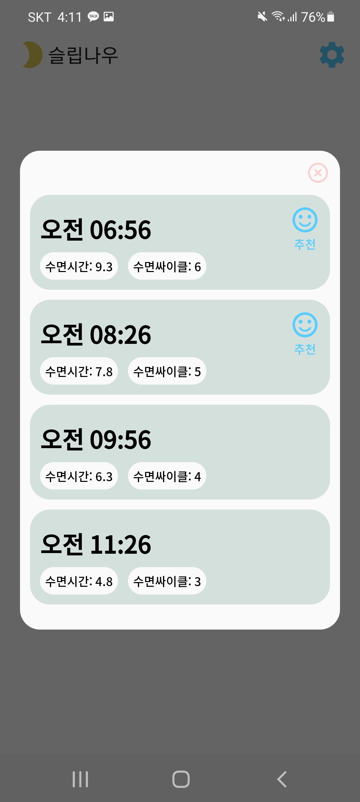
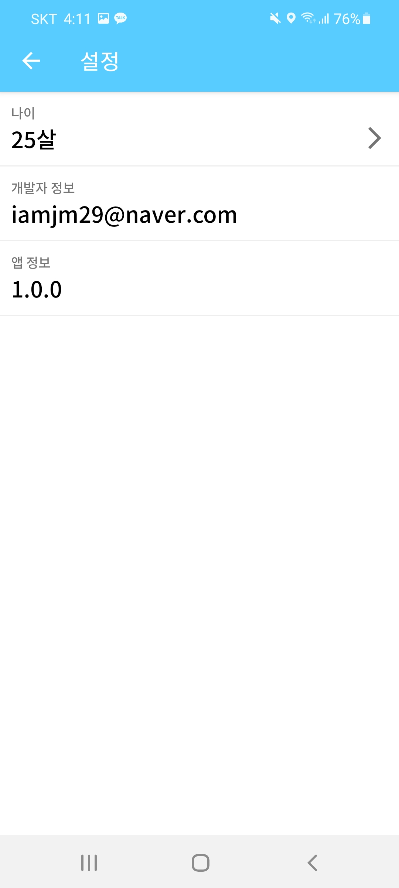

# Project: SleepNow
* 슬립 나우
* 개인 프로젝트
* 2022.01 ~ 2022.01  
[Google PlayStore](https://play.google.com/store/apps/details?id=com.jaemin.sleepnow)

> CMC 동아리 활동 전 앱 출시 경험이 없어 경험을 쌓고자 빠르게 1~2주만에 만들어본 간단한 앱  
> 이 프로젝트 덕분에 CMC 동아리 데모데이날까지 무사히 앱 출시를 완료할 수 있었다.

## 0. Overview
슬립나우는 자러 갈 시간이나 일어 날 시간을 선택하게 되면 나이에 따른 적절한 수면시간을 추천해주는 앱입니다.  
수면 단계에 따른 시간을 분석하여 자고 일어났을 때 최대한 피곤하지 않고 개운한 느낌이 들도록 해줍니다.  

## 1. Function
* 나이 선택 기능
* 시간 선택 기능
* 수면시간 계산 기능

## 2. Tech
- SharedPreference
- TimePicker
- MVVM 패턴 (viewmodel+databinding+livedata)
- EventWrapper (viewmodel에서 dialog를 띄우기 위함)
- SimpleDateFormat (날짜 형식 변환)
- CustomDialog
- TabLayout
- RecyclerView (databinding + decoration)
- OutlineTextView

## 3. UI

    
  
